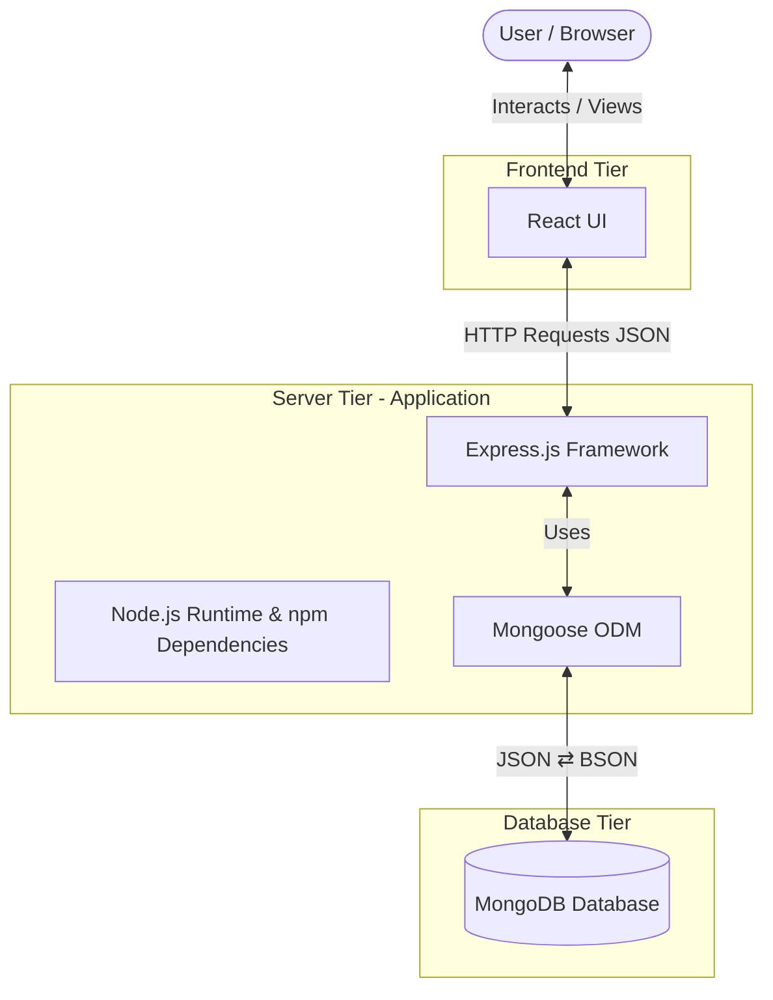
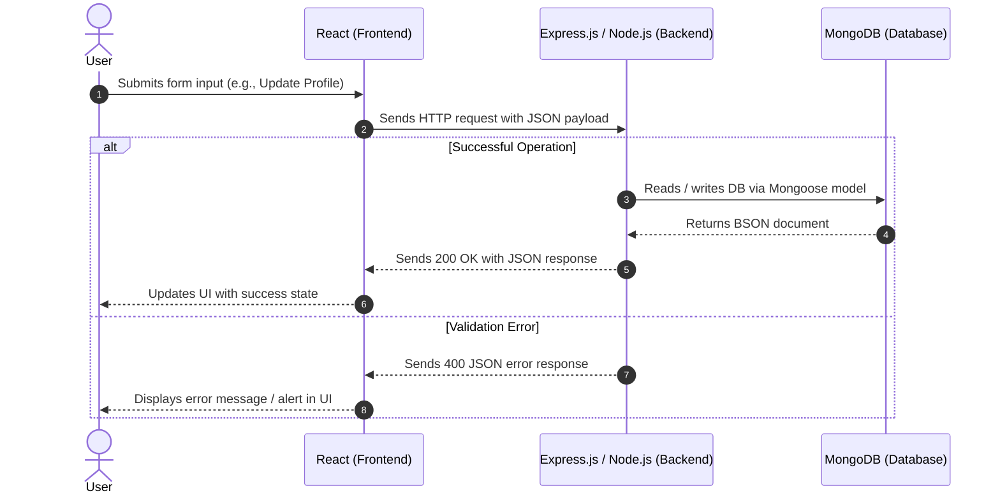

# Introduction to MERN Stack

The **MERN stack** is a full-stack JavaScript technology stack designed to build dynamic web applications using a unified JavaScript ecosystem across both the frontend and backend. Its main appeal: one language (JavaScript/TypeScript) across the entire stack, a JSON-native data model end to end, and a massive shared ecosystem via npm.

## Core Components

- [**M**ongoDB](https://www.mongodb.com/): A NoSQL document database that stores data in JSON-like (BSON) structures. The "M" is MongoDB itself; [Mongoose](https://mongoosejs.com/) is a popular but optional Object Data Modeling (ODM) library layered on top to enforce schemas, validate data, and manage models.
- [**E**xpress.js](https://expressjs.com/): A minimalist web framework for Node.js that handles HTTP routing, middleware processing, and API endpoints.
- [**R**eact](https://react.dev/): A declarative client-side JavaScript library for building interactive, component-based user interfaces. In a classic MERN setup React runs in the browser; meta-frameworks like Next.js extend it to the server as well.
- [**N**ode.js](https://nodejs.org/en): A cross-platform JavaScript runtime environment that executes backend code outside the browser. It leverages [npm](https://www.npmjs.com/) (Node Package Manager) to manage project packages, scripts, and external dependencies.

## Architecture & Data Flow

MERN follows a standard **three-tier architecture**:

1. **Frontend (Client Tier):** **React** renders user interface components in the browser.
2. **Backend (Application Tier):** **Express.js** running on **Node.js** processes API requests, applies business logic, and manages routes via **Mongoose**.
3. **Database (Data Tier):** **MongoDB** stores and retrieves application documents.

## Request / Response Lifecycle

Data flows as JSON between the client and the server, and as BSON between the server and MongoDB — Mongoose handles the conversion. The sequence below shows both a successful operation and a validation error path, including the HTTP status codes returned at each step.

